```python
import pandas as pd
import time
import numpy as np
import gc
from scipy import interp
from sklearn.cross_validation import train_test_split
from scipy.special import expit, logit

import base
import default_config
import base_models
import kfold
import stacking
```

    /home/ro/py3env/lib/python3.5/site-packages/sklearn/cross_validation.py:41: DeprecationWarning: This module was deprecated in version 0.18 in favor of the model_selection module into which all the refactored classes and functions are moved. Also note that the interface of the new CV iterators are different from that of this module. This module will be removed in 0.20.
      "This module will be removed in 0.20.", DeprecationWarning)


```python
settings = {}
settings['title'] = 'RunCase_Example'
settings['target'] = default_config.target
```

## Case 1

LightGBM


```python
%%time
settings['subtitle'] = '_case_5_lgb_feature_v7_sup_gen'
settings['train_file'] = "../input/train_feature_v7_sup.csv"
settings['train_sup_file'] = "../input/train_sup_feature_v7_sup.csv"
settings['train_sup_file_with_res'] = '../input/train_sup_feature_v7_res_lgb_1.csv'
settings['test_file'] = "../input/test_feature_v7_sup.csv"
settings['seed'] = 47
settings['test_size'] = 0.01

settings['predictors'] = ['app', 'app_by_channel_countuniq', 'channel', 'device', 'hour', 
                          'ip_app_by_os_countuniq', 'ip_app_device_os_channel_nextClick', 
                          'ip_app_os_by_hour_var', 'ip_app_oscount', 'ip_appcount', 
                          'ip_by_app_countuniq', 'ip_by_channel_countuniq', 'ip_by_device_countuniq', 
                          'ip_by_os_cumcount', 'ip_channel_prevClick', 'ip_day_by_hour_countuniq', 
                          'ip_day_hourcount', 'ip_device_os_by_app_countuniq', 'ip_device_os_by_app_cumcount', 
                          'ip_os_device_app_nextClick', 'ip_os_device_nextClick', 'ip_os_prevClick', 'os']
settings['categorical'] = ['app', 'device', 'os', 'channel', 'hour']

settings['model'] = base_models.lightgbm_model
settings['model_predict'] = base_models.lgb_predict
settings['params'] = default_config.lightgbm_params 
settings['params']['seed'] = settings['seed']
settings['params']['learning_rate'] = 0.15
settings['params']['scale_pos_weight'] = 55
settings['params']['num_leaves'] = 24
settings['params']['min_child_samples'] = 82
settings['params']['colsample_bytree'] = 0.645
settings['params']['min_split_gain'] = 0
settings['params']['device'] = 'cpu'

logger = base.Logger(settings['title'] + settings['subtitle'])
logger.print_dict(settings, order = default_config.settings_list)

logger.print_log('loading train data...')
train_df = pd.read_csv(settings['train_file'], dtype=default_config.dtypes)
y = np.zeros((train_df.shape[0], 1))
gc.collect()

logger.print_log('spliting train test...')
X_train, X_test, _, _ = train_test_split(train_df, y, test_size=settings['test_size'], random_state=settings['seed'])
del train_df, y
gc.collect()
predictions = settings['model'](X_train, X_test, settings['predictors'], settings['target'], settings['categorical'],
                                settings['params'], logger, settings['title'] + settings['subtitle'])
del X_train, X_test
gc.collect()
```

    log init.
    title           : RunCase_0501
    subtitle        : _case_5_lgb_feature_v7_sup_gen
    model           : <function lightgbm_model at 0x7f04e96d7048>
    train_file      : ../input/train_feature_v7_sup.csv
    test_file       : ../input/test_feature_v7_sup.csv
    seed            : 47
    target          : is_attributed
    predictors      : ['app', 'app_by_channel_countuniq', 'channel', 'device', 'hour', 'ip_app_by_os_countuniq', 'ip_app_device_os_channel_nextClick', 'ip_app_os_by_hour_var', 'ip_app_oscount', 'ip_appcount', 'ip_by_app_countuniq', 'ip_by_channel_countuniq', 'ip_by_device_countuniq', 'ip_by_os_cumcount', 'ip_channel_prevClick', 'ip_day_by_hour_countuniq', 'ip_day_hourcount', 'ip_device_os_by_app_countuniq', 'ip_device_os_by_app_cumcount', 'ip_os_device_app_nextClick', 'ip_os_device_nextClick', 'ip_os_prevClick', 'os']
    categorical     : ['app', 'device', 'os', 'channel', 'hour']
    test_size       : 0.01
    params          : {
               subsample: 0.7
               max_depth: 4
        colsample_bytree: 0.645
                 max_bin: 100
        scale_pos_weight: 55
           learning_rate: 0.15
       min_child_samples: 82
                  device: cpu
          subsample_freq: 1
          min_split_gain: 0
              num_leaves: 24
                 nthread: 8
        min_child_weight: 0
                    seed: 47
    }                  
    train_sup_file  : ../input/train_sup_feature_v7_sup.csv
    model_predict   : <function lgb_predict at 0x7f04e7de2048>
    train_sup_file_with_res: ../input/train_sup_feature_v7_res_lgb_1.csv
    loading train data...
    spliting train test...
    preparing validation datasets
    training...


    /home/ro/py3env/lib/python3.5/site-packages/lightgbm/basic.py:1036: UserWarning: Using categorical_feature in Dataset.
      warnings.warn('Using categorical_feature in Dataset.')
    /home/ro/py3env/lib/python3.5/site-packages/lightgbm/basic.py:681: UserWarning: categorical_feature in param dict is overrided.
      warnings.warn('categorical_feature in param dict is overrided.')


    Training until validation scores don't improve for 30 rounds.
    [10]	valid's auc: 0.96632
    [20]	valid's auc: 0.973382
    [30]	valid's auc: 0.976797
    [40]	valid's auc: 0.979686
    [50]	valid's auc: 0.980967
    [60]	valid's auc: 0.981583
    [70]	valid's auc: 0.982024
    [80]	valid's auc: 0.9825
    [90]	valid's auc: 0.982835
    [100]	valid's auc: 0.983106
    [110]	valid's auc: 0.983344
    [120]	valid's auc: 0.983552
    [130]	valid's auc: 0.983666
    [140]	valid's auc: 0.983813
    [150]	valid's auc: 0.983961
    [160]	valid's auc: 0.984032
    [170]	valid's auc: 0.984109
    [180]	valid's auc: 0.98414
    [190]	valid's auc: 0.984208
    [200]	valid's auc: 0.984323
    [210]	valid's auc: 0.98435
    [220]	valid's auc: 0.984393
    [230]	valid's auc: 0.984443
    [240]	valid's auc: 0.984523
    [250]	valid's auc: 0.984557
    [260]	valid's auc: 0.984574
    [270]	valid's auc: 0.984598
    [280]	valid's auc: 0.984634
    [290]	valid's auc: 0.984656
    [300]	valid's auc: 0.984669
    [310]	valid's auc: 0.984694
    [320]	valid's auc: 0.984703
    [330]	valid's auc: 0.984703
    [340]	valid's auc: 0.984707
    [350]	valid's auc: 0.984767
    [360]	valid's auc: 0.984781
    [370]	valid's auc: 0.98479
    [380]	valid's auc: 0.984796
    [390]	valid's auc: 0.984778
    [400]	valid's auc: 0.984797
    [410]	valid's auc: 0.984839
    [420]	valid's auc: 0.984845
    [430]	valid's auc: 0.984821
    [440]	valid's auc: 0.984841
    [450]	valid's auc: 0.984838
    Early stopping, best iteration is:
    [421]	valid's auc: 0.984851
    Model Report
    n_estimators : 421
    auc: 0.984851
    CPU times: user 5h 28min 45s, sys: 22min 1s, total: 5h 50min 46s
    Wall time: 1h 22min 17s


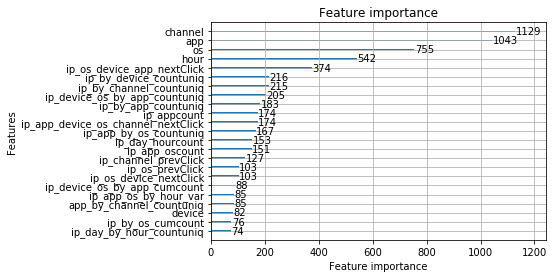


```python
%%time
model_file = '../models/' + settings['title'] + settings['subtitle'] + '.txt'
output_file = '../output/' + settings['title'] + settings['subtitle'] + '.csv.gz'
settings['model_predict'](logger, model_file, settings['test_file'], output_file, settings['predictors'])
gc.collect()
```

    loading test data...
    Predicting...
    writing to file <../output/RunCase_0501_case_5_lgb_feature_v7_sup_gen.csv.gz>...
    done.
    CPU times: user 18min 51s, sys: 8.14 s, total: 18min 59s
    Wall time: 5min 56s


## Case 2

LightGBM 10-fold CV


```python
%%time
settings['subtitle'] = '_case_2_lgb_feature_v7_sup_10fold'
settings['train_file'] = "../input/train_feature_v7_sup.csv"
settings['train_sup_file'] = "../input/train_sup_feature_v7_sup.csv"
settings['test_file'] = "../input/test_feature_v7_sup.csv"
settings['seed'] = 47
settings['test_size'] = 0.01
settings['predictors'] = ['app', 'app_by_channel_countuniq', 'channel', 'device', 'hour', 
                          'ip_app_by_os_countuniq', 'ip_app_device_os_channel_nextClick', 
                          'ip_app_os_by_hour_var', 'ip_app_oscount', 'ip_appcount', 
                          'ip_by_app_countuniq', 'ip_by_channel_countuniq', 'ip_by_device_countuniq', 
                          'ip_by_os_cumcount', 'ip_channel_prevClick', 'ip_day_by_hour_countuniq', 
                          'ip_day_hourcount', 'ip_device_os_by_app_countuniq', 'ip_device_os_by_app_cumcount', 
                          'ip_os_device_app_nextClick', 'ip_os_device_nextClick', 'ip_os_prevClick', 'os']
settings['categorical'] = ['app', 'device', 'os', 'channel', 'hour']

settings['kfold'] = 10
settings['model'] = kfold.kfold_train
settings['base_model'] = base_models.lightgbm_model
settings['model_train_predict'] = kfold.kfold_lgb_train_predict
settings['model_predict'] = base_models.lgb_cv_predict
settings['params'] = default_config.lightgbm_params 
settings['params']['seed'] = settings['seed']
settings['params']['learning_rate'] = 0.15
settings['params']['scale_pos_weight'] = 55
settings['params']['num_leaves'] = 24
settings['params']['min_child_samples'] = 82
settings['params']['colsample_bytree'] = 0.645
settings['params']['min_split_gain'] = 0
settings['params']['device'] = 'cpu'

logger = base.Logger(settings['title'] + settings['subtitle'])
logger.print_dict(settings, order = default_config.settings_list)

logger.print_log('loading train data...')
train_df = pd.read_csv(settings['train_file'], dtype=default_config.dtypes)
gc.collect()

logger.print_log('load finished.')
predictions = settings['model'](settings['base_model'], settings['kfold'], train_df, settings['predictors'], 
                                settings['target'], settings['categorical'],settings['params'], 
                                logger, settings['title'] + settings['subtitle'])
```

    log init.
    title           : RunCase_0502
    subtitle        : _case_2_lgb_feature_v7_sup_10fold
    model           : <function kfold_train at 0x7f9e55fb5ea0>
    train_file      : ../input/train_feature_v7_sup.csv
    test_file       : ../input/test_feature_v7_sup.csv
    seed            : 47
    target          : is_attributed
    predictors      : ['app', 'app_by_channel_countuniq', 'channel', 'device', 'hour', 'ip_app_by_os_countuniq', 'ip_app_device_os_channel_nextClick', 'ip_app_os_by_hour_var', 'ip_app_oscount', 'ip_appcount', 'ip_by_app_countuniq', 'ip_by_channel_countuniq', 'ip_by_device_countuniq', 'ip_by_os_cumcount', 'ip_channel_prevClick', 'ip_day_by_hour_countuniq', 'ip_day_hourcount', 'ip_device_os_by_app_countuniq', 'ip_device_os_by_app_cumcount', 'ip_os_device_app_nextClick', 'ip_os_device_nextClick', 'ip_os_prevClick', 'os']
    categorical     : ['app', 'device', 'os', 'channel', 'hour']
    train_sup_file  : ../input/train_sup_feature_v7_sup.csv
    params          : {
               subsample: 0.7
                 nthread: 8
                    seed: 47
        min_child_weight: 0
           learning_rate: 0.15
        colsample_bytree: 0.645
               max_depth: 4
       min_child_samples: 82
              num_leaves: 24
        scale_pos_weight: 55
          subsample_freq: 1
          min_split_gain: 0
                  device: cpu
                 max_bin: 100
    }                  
    model_train_predict: <function kfold_lgb_train_predict at 0x7f9e55fb5f28>
    kfold           : 10
    test_size       : 0.01
    base_model      : <function lightgbm_model at 0x7f9e5aa5c9d8>
    model_predict   : <function lgb_cv_predict at 0x7f9e59376a60>
    loading train data...
    load finished.
    cv_0 start
    preparing validation datasets
    training...


    /home/ro/py3env/lib/python3.5/site-packages/lightgbm/basic.py:1036: UserWarning: Using categorical_feature in Dataset.
      warnings.warn('Using categorical_feature in Dataset.')
    /home/ro/py3env/lib/python3.5/site-packages/lightgbm/basic.py:681: UserWarning: categorical_feature in param dict is overrided.
      warnings.warn('categorical_feature in param dict is overrided.')


    Training until validation scores don't improve for 30 rounds.
    [10]	valid's auc: 0.969181
    [20]	valid's auc: 0.975633
    [30]	valid's auc: 0.978596
    [40]	valid's auc: 0.981322
    [50]	valid's auc: 0.982301
    [60]	valid's auc: 0.98293
    [70]	valid's auc: 0.98336
    [80]	valid's auc: 0.983729
    [90]	valid's auc: 0.983938
    [100]	valid's auc: 0.984113
    [110]	valid's auc: 0.984301
    [120]	valid's auc: 0.984441
    [130]	valid's auc: 0.984582
    [140]	valid's auc: 0.984665
    [150]	valid's auc: 0.984749
    [160]	valid's auc: 0.984866
    [170]	valid's auc: 0.984936
    [180]	valid's auc: 0.98498
    [190]	valid's auc: 0.985045
    [200]	valid's auc: 0.985101
    [210]	valid's auc: 0.985172
    [220]	valid's auc: 0.985212
    [230]	valid's auc: 0.98525
    [240]	valid's auc: 0.985281
    [250]	valid's auc: 0.98532
    [260]	valid's auc: 0.985352
    [270]	valid's auc: 0.985395
    [280]	valid's auc: 0.985423
    [290]	valid's auc: 0.985455
    [300]	valid's auc: 0.98546
    [310]	valid's auc: 0.985479
    [320]	valid's auc: 0.985489
    [330]	valid's auc: 0.985514
    [340]	valid's auc: 0.98553
    [350]	valid's auc: 0.985546
    [360]	valid's auc: 0.985554
    [370]	valid's auc: 0.985563
    [380]	valid's auc: 0.985573
    [390]	valid's auc: 0.985581
    [400]	valid's auc: 0.985584
    [410]	valid's auc: 0.985602
    [420]	valid's auc: 0.985609
    [430]	valid's auc: 0.985609
    [440]	valid's auc: 0.985615
    [450]	valid's auc: 0.985618
    [460]	valid's auc: 0.985621
    [470]	valid's auc: 0.985633
    [480]	valid's auc: 0.985635
    [490]	valid's auc: 0.985636
    [500]	valid's auc: 0.985631
    [510]	valid's auc: 0.985638
    [520]	valid's auc: 0.985643
    [530]	valid's auc: 0.985644
    [540]	valid's auc: 0.985653
    [550]	valid's auc: 0.985665
    [560]	valid's auc: 0.985678
    [570]	valid's auc: 0.985682
    [580]	valid's auc: 0.985685
    [590]	valid's auc: 0.985691
    [600]	valid's auc: 0.9857
    [610]	valid's auc: 0.985701
    [620]	valid's auc: 0.985707
    [630]	valid's auc: 0.985708
    [640]	valid's auc: 0.985702
    [650]	valid's auc: 0.985707
    Early stopping, best iteration is:
    [627]	valid's auc: 0.985715
    Model Report
    n_estimators : 627
    auc: 0.985715
    cv_0 finished.
    cv_1 start
    preparing validation datasets
    training...
    Training until validation scores don't improve for 30 rounds.
    [10]	valid's auc: 0.970371
    [20]	valid's auc: 0.974773
    [30]	valid's auc: 0.97773
    [40]	valid's auc: 0.980455
    [50]	valid's auc: 0.981713
    [60]	valid's auc: 0.982426
    [70]	valid's auc: 0.982912
    [80]	valid's auc: 0.983191
    [90]	valid's auc: 0.983452
    [100]	valid's auc: 0.983717
    [110]	valid's auc: 0.98391
    [120]	valid's auc: 0.984073
    [130]	valid's auc: 0.984193
    [140]	valid's auc: 0.9843
    [150]	valid's auc: 0.984398
    [160]	valid's auc: 0.984471
    [170]	valid's auc: 0.984554
    [180]	valid's auc: 0.984621
    [190]	valid's auc: 0.984674
    [200]	valid's auc: 0.984739
    [210]	valid's auc: 0.984781
    [220]	valid's auc: 0.984821
    [230]	valid's auc: 0.984868
    [240]	valid's auc: 0.98492
    [250]	valid's auc: 0.984967
    [260]	valid's auc: 0.984999
    [270]	valid's auc: 0.985036
    [280]	valid's auc: 0.985048
    [290]	valid's auc: 0.98508
    [300]	valid's auc: 0.985097
    [310]	valid's auc: 0.985118
    [320]	valid's auc: 0.985144
    [330]	valid's auc: 0.985176
    [340]	valid's auc: 0.985209
    [350]	valid's auc: 0.985216
    [360]	valid's auc: 0.985226
    [370]	valid's auc: 0.985235
    [380]	valid's auc: 0.985251
    [390]	valid's auc: 0.985263
    [400]	valid's auc: 0.985269
    [410]	valid's auc: 0.98528
    [420]	valid's auc: 0.985292
    [430]	valid's auc: 0.985308
    [440]	valid's auc: 0.98531
    [450]	valid's auc: 0.985317
    [460]	valid's auc: 0.98532
    [470]	valid's auc: 0.985324
    [480]	valid's auc: 0.98534
    [490]	valid's auc: 0.985338
    [500]	valid's auc: 0.985336
    [510]	valid's auc: 0.985344
    [520]	valid's auc: 0.985356
    [530]	valid's auc: 0.985366
    [540]	valid's auc: 0.985366
    [550]	valid's auc: 0.985373
    [560]	valid's auc: 0.98537
    [570]	valid's auc: 0.985377
    [580]	valid's auc: 0.985373
    [590]	valid's auc: 0.985378
    [600]	valid's auc: 0.98539
    [610]	valid's auc: 0.985391
    [620]	valid's auc: 0.985396
    [630]	valid's auc: 0.985397
    [640]	valid's auc: 0.985395
    [650]	valid's auc: 0.985396
    Early stopping, best iteration is:
    [627]	valid's auc: 0.985401
    Model Report
    n_estimators : 627
    auc: 0.985401
    cv_1 finished.
    cv_2 start
    preparing validation datasets
    training...
    Training until validation scores don't improve for 30 rounds.
    [10]	valid's auc: 0.969426
    [20]	valid's auc: 0.975651
    [30]	valid's auc: 0.97832
    [40]	valid's auc: 0.981168
    [50]	valid's auc: 0.982396
    [60]	valid's auc: 0.982954
    [70]	valid's auc: 0.983492
    [80]	valid's auc: 0.983823
    [90]	valid's auc: 0.98413
    [100]	valid's auc: 0.984352
    [110]	valid's auc: 0.984513
    [120]	valid's auc: 0.984632
    [130]	valid's auc: 0.984791
    [140]	valid's auc: 0.984867
    [150]	valid's auc: 0.984953
    [160]	valid's auc: 0.985037
    [170]	valid's auc: 0.985107
    [180]	valid's auc: 0.985151
    [190]	valid's auc: 0.985203
    [200]	valid's auc: 0.98525
    [210]	valid's auc: 0.985297
    [220]	valid's auc: 0.985333
    [230]	valid's auc: 0.985365
    [240]	valid's auc: 0.985397
    [250]	valid's auc: 0.985445
    [260]	valid's auc: 0.985469
    [270]	valid's auc: 0.985492
    [280]	valid's auc: 0.985504
    [290]	valid's auc: 0.985539
    [300]	valid's auc: 0.985564
    [310]	valid's auc: 0.985589
    [320]	valid's auc: 0.985607
    [330]	valid's auc: 0.98562
    [340]	valid's auc: 0.985628
    [350]	valid's auc: 0.985636
    [360]	valid's auc: 0.985659
    [370]	valid's auc: 0.985672
    [380]	valid's auc: 0.985674
    [390]	valid's auc: 0.985677
    [400]	valid's auc: 0.985678
    [410]	valid's auc: 0.985687
    [420]	valid's auc: 0.985696
    [430]	valid's auc: 0.98571
    [440]	valid's auc: 0.985712
    [450]	valid's auc: 0.985725
    [460]	valid's auc: 0.985733
    [470]	valid's auc: 0.985739
    [480]	valid's auc: 0.985756
    [490]	valid's auc: 0.985757
    [500]	valid's auc: 0.985764
    [510]	valid's auc: 0.985761
    [520]	valid's auc: 0.985765
    [530]	valid's auc: 0.985762
    [540]	valid's auc: 0.985772
    [550]	valid's auc: 0.98577
    [560]	valid's auc: 0.985783
    [570]	valid's auc: 0.985797
    [580]	valid's auc: 0.985788
    [590]	valid's auc: 0.985788
    Early stopping, best iteration is:
    [569]	valid's auc: 0.985798
    Model Report
    n_estimators : 569
    auc: 0.985798
    cv_2 finished.
    cv_3 start
    preparing validation datasets
    training...
    Training until validation scores don't improve for 30 rounds.
    [10]	valid's auc: 0.967343
    [20]	valid's auc: 0.974378
    [30]	valid's auc: 0.977533
    [40]	valid's auc: 0.980216
    [50]	valid's auc: 0.981416
    [60]	valid's auc: 0.982004
    [70]	valid's auc: 0.982556
    [80]	valid's auc: 0.983002
    [90]	valid's auc: 0.98325
    [100]	valid's auc: 0.98349
    [110]	valid's auc: 0.983633
    [120]	valid's auc: 0.983781
    [130]	valid's auc: 0.983897
    [140]	valid's auc: 0.984045
    [150]	valid's auc: 0.984136
    [160]	valid's auc: 0.984195
    [170]	valid's auc: 0.984301
    [180]	valid's auc: 0.984358
    [190]	valid's auc: 0.984415
    [200]	valid's auc: 0.984469
    [210]	valid's auc: 0.984523
    [220]	valid's auc: 0.984564
    [230]	valid's auc: 0.984599
    [240]	valid's auc: 0.984659
    [250]	valid's auc: 0.984691
    [260]	valid's auc: 0.984726
    [270]	valid's auc: 0.984787
    [280]	valid's auc: 0.984801
    [290]	valid's auc: 0.984827
    [300]	valid's auc: 0.98484
    [310]	valid's auc: 0.984872
    [320]	valid's auc: 0.984897
    [330]	valid's auc: 0.984916
    [340]	valid's auc: 0.984932
    [350]	valid's auc: 0.984953
    [360]	valid's auc: 0.984961
    [370]	valid's auc: 0.984961
    [380]	valid's auc: 0.984964
    [390]	valid's auc: 0.984978
    [400]	valid's auc: 0.984976
    [410]	valid's auc: 0.984981
    [420]	valid's auc: 0.984996
    [430]	valid's auc: 0.98502
    [440]	valid's auc: 0.985025
    [450]	valid's auc: 0.985026
    [460]	valid's auc: 0.985048
    [470]	valid's auc: 0.985059
    [480]	valid's auc: 0.985077
    [490]	valid's auc: 0.985081
    [500]	valid's auc: 0.98509
    [510]	valid's auc: 0.985086
    [520]	valid's auc: 0.985091
    [530]	valid's auc: 0.985094
    Early stopping, best iteration is:
    [504]	valid's auc: 0.985097
    Model Report
    n_estimators : 504
    auc: 0.985097
    cv_3 finished.
    cv_4 start
    preparing validation datasets
    training...
    Training until validation scores don't improve for 30 rounds.
    [10]	valid's auc: 0.970329
    [20]	valid's auc: 0.975993
    [30]	valid's auc: 0.978796
    [40]	valid's auc: 0.981734
    [50]	valid's auc: 0.982813
    [60]	valid's auc: 0.983401
    [70]	valid's auc: 0.983732
    [80]	valid's auc: 0.98403
    [90]	valid's auc: 0.984224
    [100]	valid's auc: 0.984491
    [110]	valid's auc: 0.984655
    [120]	valid's auc: 0.984787
    [130]	valid's auc: 0.984919
    [140]	valid's auc: 0.985011
    [150]	valid's auc: 0.98512
    [160]	valid's auc: 0.985176
    [170]	valid's auc: 0.985223
    [180]	valid's auc: 0.985279
    [190]	valid's auc: 0.985336
    [200]	valid's auc: 0.985384
    [210]	valid's auc: 0.985433
    [220]	valid's auc: 0.985464
    [230]	valid's auc: 0.985497
    [240]	valid's auc: 0.985531
    [250]	valid's auc: 0.985557
    [260]	valid's auc: 0.985584
    [270]	valid's auc: 0.985607
    [280]	valid's auc: 0.985622
    [290]	valid's auc: 0.985662
    [300]	valid's auc: 0.985677
    [310]	valid's auc: 0.985685
    [320]	valid's auc: 0.985697
    [330]	valid's auc: 0.985717
    [340]	valid's auc: 0.985725
    [350]	valid's auc: 0.98573
    [360]	valid's auc: 0.985745
    [370]	valid's auc: 0.985754
    [380]	valid's auc: 0.98576
    [390]	valid's auc: 0.98578
    [400]	valid's auc: 0.985789
    [410]	valid's auc: 0.985787
    [420]	valid's auc: 0.985803
    [430]	valid's auc: 0.985813
    [440]	valid's auc: 0.985824
    [450]	valid's auc: 0.985838
    [460]	valid's auc: 0.985844
    [470]	valid's auc: 0.985854
    [480]	valid's auc: 0.985875
    [490]	valid's auc: 0.98588
    [500]	valid's auc: 0.985891
    [510]	valid's auc: 0.985895
    [520]	valid's auc: 0.985903
    [530]	valid's auc: 0.985902
    [540]	valid's auc: 0.9859
    [550]	valid's auc: 0.985911
    [560]	valid's auc: 0.985914
    [570]	valid's auc: 0.985925
    [580]	valid's auc: 0.985926
    [590]	valid's auc: 0.985935
    [600]	valid's auc: 0.985939
    [610]	valid's auc: 0.985935
    [620]	valid's auc: 0.98594
    [630]	valid's auc: 0.985939
    [640]	valid's auc: 0.985941
    [650]	valid's auc: 0.985948
    [660]	valid's auc: 0.985962
    [670]	valid's auc: 0.985965
    [680]	valid's auc: 0.985964
    [690]	valid's auc: 0.985958
    Early stopping, best iteration is:
    [669]	valid's auc: 0.985965
    Model Report
    n_estimators : 669
    auc: 0.985965
    cv_4 finished.
    cv_5 start
    preparing validation datasets
    training...
    Training until validation scores don't improve for 30 rounds.
    [10]	valid's auc: 0.970272
    [20]	valid's auc: 0.975117
    [30]	valid's auc: 0.977875
    [40]	valid's auc: 0.980903
    [50]	valid's auc: 0.981984
    [60]	valid's auc: 0.982627
    [70]	valid's auc: 0.983032
    [80]	valid's auc: 0.983432
    [90]	valid's auc: 0.983612
    [100]	valid's auc: 0.983863
    [110]	valid's auc: 0.98403
    [120]	valid's auc: 0.984181
    [130]	valid's auc: 0.984274
    [140]	valid's auc: 0.984393
    [150]	valid's auc: 0.984489
    [160]	valid's auc: 0.984546
    [170]	valid's auc: 0.984607
    [180]	valid's auc: 0.984665
    [190]	valid's auc: 0.984701
    [200]	valid's auc: 0.984739
    [210]	valid's auc: 0.984785
    [220]	valid's auc: 0.984821
    [230]	valid's auc: 0.984856
    [240]	valid's auc: 0.984894
    [250]	valid's auc: 0.984926
    [260]	valid's auc: 0.984954
    [270]	valid's auc: 0.984997
    [280]	valid's auc: 0.985025
    [290]	valid's auc: 0.985047
    [300]	valid's auc: 0.985056
    [310]	valid's auc: 0.98507
    [320]	valid's auc: 0.985079
    [330]	valid's auc: 0.985096
    [340]	valid's auc: 0.985106
    [350]	valid's auc: 0.985127
    [360]	valid's auc: 0.98513
    [370]	valid's auc: 0.985161
    [380]	valid's auc: 0.985181
    [390]	valid's auc: 0.985192
    [400]	valid's auc: 0.985196
    [410]	valid's auc: 0.985207
    [420]	valid's auc: 0.985219
    [430]	valid's auc: 0.985234
    [440]	valid's auc: 0.985255
    [450]	valid's auc: 0.985259
    [460]	valid's auc: 0.985273
    [470]	valid's auc: 0.985277
    [480]	valid's auc: 0.985288
    [490]	valid's auc: 0.985296
    [500]	valid's auc: 0.985299
    [510]	valid's auc: 0.985315
    [520]	valid's auc: 0.985317
    [530]	valid's auc: 0.985319
    [540]	valid's auc: 0.985324
    [550]	valid's auc: 0.985332
    [560]	valid's auc: 0.985337
    [570]	valid's auc: 0.985347
    [580]	valid's auc: 0.98534
    [590]	valid's auc: 0.985335
    Early stopping, best iteration is:
    [569]	valid's auc: 0.985352
    Model Report
    n_estimators : 569
    auc: 0.985352
    cv_5 finished.
    cv_6 start
    preparing validation datasets
    training...
    Training until validation scores don't improve for 30 rounds.
    [10]	valid's auc: 0.970125
    [20]	valid's auc: 0.975651
    [30]	valid's auc: 0.978395
    [40]	valid's auc: 0.981323
    [50]	valid's auc: 0.982621
    [60]	valid's auc: 0.983306
    [70]	valid's auc: 0.983687
    [80]	valid's auc: 0.984052
    [90]	valid's auc: 0.984235
    [100]	valid's auc: 0.984522
    [110]	valid's auc: 0.984698
    [120]	valid's auc: 0.984829
    [130]	valid's auc: 0.984962
    [140]	valid's auc: 0.985079
    [150]	valid's auc: 0.985174
    [160]	valid's auc: 0.985239
    [170]	valid's auc: 0.985299
    [180]	valid's auc: 0.985348
    [190]	valid's auc: 0.985406
    [200]	valid's auc: 0.985462
    [210]	valid's auc: 0.985499
    [220]	valid's auc: 0.985531
    [230]	valid's auc: 0.98557
    [240]	valid's auc: 0.985624
    [250]	valid's auc: 0.985644
    [260]	valid's auc: 0.985663
    [270]	valid's auc: 0.985682
    [280]	valid's auc: 0.98572
    [290]	valid's auc: 0.985729
    [300]	valid's auc: 0.985739
    [310]	valid's auc: 0.985757
    [320]	valid's auc: 0.985773
    [330]	valid's auc: 0.98579
    [340]	valid's auc: 0.985797
    [350]	valid's auc: 0.985811
    [360]	valid's auc: 0.98583
    [370]	valid's auc: 0.985839
    [380]	valid's auc: 0.985859
    [390]	valid's auc: 0.985864
    [400]	valid's auc: 0.985876
    [410]	valid's auc: 0.985876
    [420]	valid's auc: 0.985889
    [430]	valid's auc: 0.985893
    [440]	valid's auc: 0.985894
    [450]	valid's auc: 0.985903
    [460]	valid's auc: 0.985906
    [470]	valid's auc: 0.985918
    [480]	valid's auc: 0.985925
    [490]	valid's auc: 0.985927
    [500]	valid's auc: 0.985923
    [510]	valid's auc: 0.985926
    [520]	valid's auc: 0.985931
    [530]	valid's auc: 0.985925
    [540]	valid's auc: 0.985938
    [550]	valid's auc: 0.985948
    [560]	valid's auc: 0.985956
    [570]	valid's auc: 0.985956
    [580]	valid's auc: 0.985956
    [590]	valid's auc: 0.98596
    [600]	valid's auc: 0.98597
    [610]	valid's auc: 0.985975
    [620]	valid's auc: 0.98598
    [630]	valid's auc: 0.985973
    [640]	valid's auc: 0.985967
    [650]	valid's auc: 0.985971
    [660]	valid's auc: 0.985982
    [670]	valid's auc: 0.985981
    [680]	valid's auc: 0.98598
    [690]	valid's auc: 0.985989
    [700]	valid's auc: 0.985986
    [710]	valid's auc: 0.985988
    [720]	valid's auc: 0.985987
    Early stopping, best iteration is:
    [692]	valid's auc: 0.985993
    Model Report
    n_estimators : 692
    auc: 0.985993
    cv_6 finished.
    cv_7 start
    preparing validation datasets
    training...
    Training until validation scores don't improve for 30 rounds.
    [10]	valid's auc: 0.970439
    [20]	valid's auc: 0.975109
    [30]	valid's auc: 0.977359
    [40]	valid's auc: 0.980394
    [50]	valid's auc: 0.981543
    [60]	valid's auc: 0.982132
    [70]	valid's auc: 0.982597
    [80]	valid's auc: 0.982961
    [90]	valid's auc: 0.983223
    [100]	valid's auc: 0.983467
    [110]	valid's auc: 0.983637
    [120]	valid's auc: 0.983799
    [130]	valid's auc: 0.983921
    [140]	valid's auc: 0.98405
    [150]	valid's auc: 0.984138
    [160]	valid's auc: 0.984206
    [170]	valid's auc: 0.984303
    [180]	valid's auc: 0.984377
    [190]	valid's auc: 0.984442
    [200]	valid's auc: 0.984489
    [210]	valid's auc: 0.984538
    [220]	valid's auc: 0.9846
    [230]	valid's auc: 0.984643
    [240]	valid's auc: 0.984673
    [250]	valid's auc: 0.984694
    [260]	valid's auc: 0.98472
    [270]	valid's auc: 0.984755
    [280]	valid's auc: 0.984773
    [290]	valid's auc: 0.984809
    [300]	valid's auc: 0.984832
    [310]	valid's auc: 0.984852
    [320]	valid's auc: 0.98487
    [330]	valid's auc: 0.984896
    [340]	valid's auc: 0.984917
    [350]	valid's auc: 0.98493
    [360]	valid's auc: 0.984938
    [370]	valid's auc: 0.984961
    [380]	valid's auc: 0.984973
    [390]	valid's auc: 0.984988
    [400]	valid's auc: 0.985001
    [410]	valid's auc: 0.985014
    [420]	valid's auc: 0.985025
    [430]	valid's auc: 0.985046
    [440]	valid's auc: 0.985051
    [450]	valid's auc: 0.985063
    [460]	valid's auc: 0.985075
    [470]	valid's auc: 0.985086
    [480]	valid's auc: 0.985102
    [490]	valid's auc: 0.98511
    [500]	valid's auc: 0.985108
    [510]	valid's auc: 0.985109
    [520]	valid's auc: 0.985108
    [530]	valid's auc: 0.985112
    [540]	valid's auc: 0.985117
    [550]	valid's auc: 0.985129
    [560]	valid's auc: 0.985135
    [570]	valid's auc: 0.985144
    [580]	valid's auc: 0.985146
    [590]	valid's auc: 0.985149
    [600]	valid's auc: 0.985158
    [610]	valid's auc: 0.985159
    [620]	valid's auc: 0.985171
    [630]	valid's auc: 0.985183
    [640]	valid's auc: 0.985191
    [650]	valid's auc: 0.985195
    [660]	valid's auc: 0.985203
    [670]	valid's auc: 0.985203
    [680]	valid's auc: 0.985209
    [690]	valid's auc: 0.985213
    [700]	valid's auc: 0.985219
    [710]	valid's auc: 0.985219
    [720]	valid's auc: 0.985218
    [730]	valid's auc: 0.985218
    Early stopping, best iteration is:
    [705]	valid's auc: 0.985224
    Model Report
    n_estimators : 705
    auc: 0.985224
    cv_7 finished.
    cv_8 start
    preparing validation datasets
    training...
    Training until validation scores don't improve for 30 rounds.
    [10]	valid's auc: 0.96866
    [20]	valid's auc: 0.974291
    [30]	valid's auc: 0.977911
    [40]	valid's auc: 0.980792
    [50]	valid's auc: 0.982021
    [60]	valid's auc: 0.982702
    [70]	valid's auc: 0.983112
    [80]	valid's auc: 0.983439
    [90]	valid's auc: 0.983672
    [100]	valid's auc: 0.983888
    [110]	valid's auc: 0.984014
    [120]	valid's auc: 0.984167
    [130]	valid's auc: 0.984262
    [140]	valid's auc: 0.984377
    [150]	valid's auc: 0.984471
    [160]	valid's auc: 0.984563
    [170]	valid's auc: 0.984608
    [180]	valid's auc: 0.984661
    [190]	valid's auc: 0.984715
    [200]	valid's auc: 0.984779
    [210]	valid's auc: 0.984834
    [220]	valid's auc: 0.984861
    [230]	valid's auc: 0.984889
    [240]	valid's auc: 0.984904
    [250]	valid's auc: 0.984931
    [260]	valid's auc: 0.984949
    [270]	valid's auc: 0.984972
    [280]	valid's auc: 0.984993
    [290]	valid's auc: 0.985002
    [300]	valid's auc: 0.985004
    [310]	valid's auc: 0.985015
    [320]	valid's auc: 0.985033
    [330]	valid's auc: 0.985056
    [340]	valid's auc: 0.985074
    [350]	valid's auc: 0.985087
    [360]	valid's auc: 0.9851
    [370]	valid's auc: 0.985118
    [380]	valid's auc: 0.985135
    [390]	valid's auc: 0.985145
    [400]	valid's auc: 0.985159
    [410]	valid's auc: 0.985165
    [420]	valid's auc: 0.985179
    [430]	valid's auc: 0.98519
    [440]	valid's auc: 0.985198
    [450]	valid's auc: 0.985206
    [460]	valid's auc: 0.985206
    [470]	valid's auc: 0.985215
    [480]	valid's auc: 0.985242
    [490]	valid's auc: 0.985244
    [500]	valid's auc: 0.985249
    [510]	valid's auc: 0.985263
    [520]	valid's auc: 0.985258
    [530]	valid's auc: 0.985264
    [540]	valid's auc: 0.985271
    [550]	valid's auc: 0.985278
    [560]	valid's auc: 0.985272
    [570]	valid's auc: 0.985291
    [580]	valid's auc: 0.985282
    [590]	valid's auc: 0.985284
    [600]	valid's auc: 0.985288
    Early stopping, best iteration is:
    [570]	valid's auc: 0.985291
    Model Report
    n_estimators : 570
    auc: 0.985291
    cv_8 finished.
    cv_9 start
    preparing validation datasets
    training...
    Training until validation scores don't improve for 30 rounds.
    [10]	valid's auc: 0.971169
    [20]	valid's auc: 0.975457
    [30]	valid's auc: 0.977847
    [40]	valid's auc: 0.980691
    [50]	valid's auc: 0.982
    [60]	valid's auc: 0.982672
    [70]	valid's auc: 0.983051
    [80]	valid's auc: 0.983402
    [90]	valid's auc: 0.983666
    [100]	valid's auc: 0.983915
    [110]	valid's auc: 0.984103
    [120]	valid's auc: 0.984247
    [130]	valid's auc: 0.984369
    [140]	valid's auc: 0.984476
    [150]	valid's auc: 0.984566
    [160]	valid's auc: 0.984638
    [170]	valid's auc: 0.984709
    [180]	valid's auc: 0.984792
    [190]	valid's auc: 0.984829
    [200]	valid's auc: 0.984908
    [210]	valid's auc: 0.984967
    [220]	valid's auc: 0.985007
    [230]	valid's auc: 0.985054
    [240]	valid's auc: 0.985086
    [250]	valid's auc: 0.985107
    [260]	valid's auc: 0.985146
    [270]	valid's auc: 0.985175
    [280]	valid's auc: 0.985206
    [290]	valid's auc: 0.985224
    [300]	valid's auc: 0.985243
    [310]	valid's auc: 0.985266
    [320]	valid's auc: 0.985276
    [330]	valid's auc: 0.985291
    [340]	valid's auc: 0.985303
    [350]	valid's auc: 0.985313
    [360]	valid's auc: 0.985325
    [370]	valid's auc: 0.985338
    [380]	valid's auc: 0.985341
    [390]	valid's auc: 0.98536
    [400]	valid's auc: 0.985369
    [410]	valid's auc: 0.985373
    [420]	valid's auc: 0.985384
    [430]	valid's auc: 0.985398
    [440]	valid's auc: 0.985408
    [450]	valid's auc: 0.985418
    [460]	valid's auc: 0.985423
    [470]	valid's auc: 0.985437
    [480]	valid's auc: 0.98544
    [490]	valid's auc: 0.985444
    [500]	valid's auc: 0.985449
    [510]	valid's auc: 0.985453
    [520]	valid's auc: 0.985463
    [530]	valid's auc: 0.985467
    [540]	valid's auc: 0.985473
    [550]	valid's auc: 0.985477
    [560]	valid's auc: 0.985478
    [570]	valid's auc: 0.985489
    [580]	valid's auc: 0.985494
    [590]	valid's auc: 0.985504
    [600]	valid's auc: 0.985512
    [610]	valid's auc: 0.985516
    [620]	valid's auc: 0.985511
    [630]	valid's auc: 0.985512
    [640]	valid's auc: 0.985513
    Early stopping, best iteration is:
    [612]	valid's auc: 0.985518
    Model Report
    n_estimators : 612
    auc: 0.985518
    cv_9 finished.
    done.
    CPU times: user 3d 14h 34min 4s, sys: 2h 44min 48s, total: 3d 17h 18min 53s
    Wall time: 20h 35min 55s


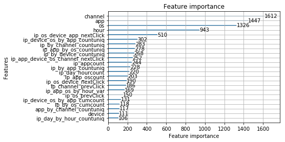


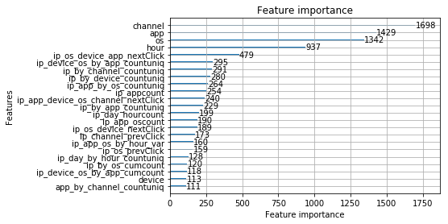


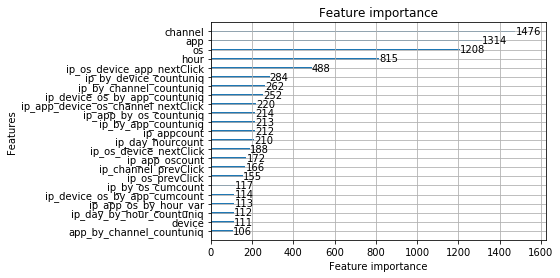


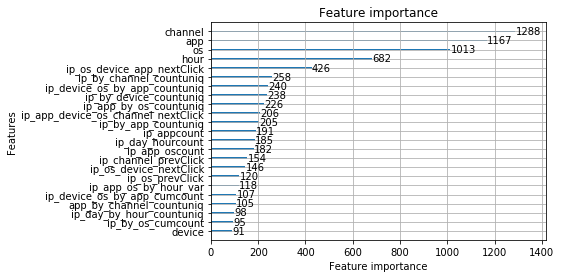


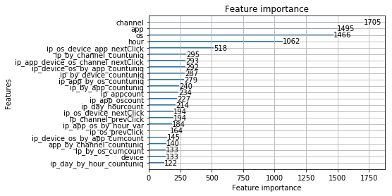


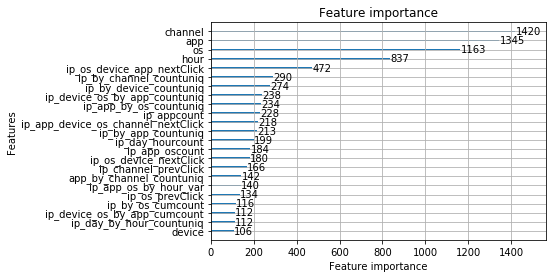


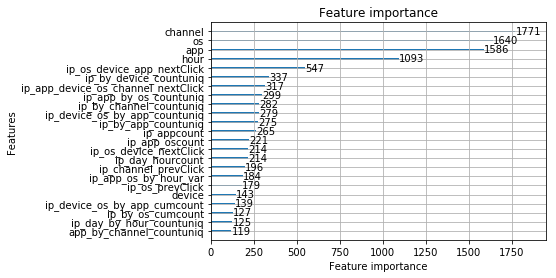


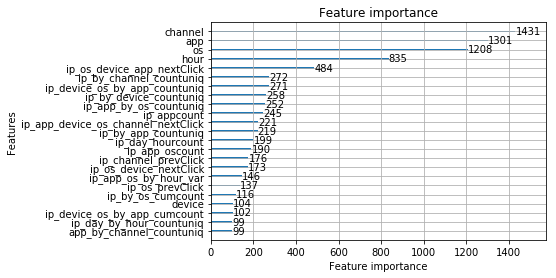


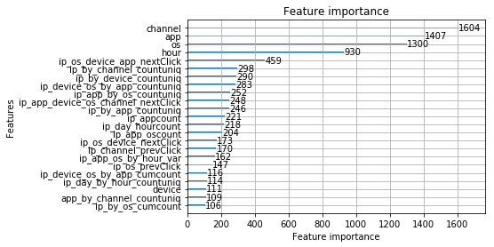


```python
output_file = '../output/' + settings['title'] + settings['subtitle'] + '.csv'
model_files = []
for i in range(settings['kfold']):
    model_files.append('../models/' + settings['title'] + settings['subtitle'] + '_cv_' + str(i) + '.txt')
settings['model_predict'](logger, model_files, settings['test_file'], output_file, settings['predictors'])
gc.collect()
```

    loading test data...
    Predicting...
    writing to file <../output/RunCase_0502_case_2_lgb_feature_v7_sup_10fold.csv>...
    done.


    52228


```python
model_files = []
for i in range(settings['kfold']):
    model_files.append('../models/' + settings['title'] + settings['subtitle'] + '_cv_' + str(i) + '.txt')
settings['model_train_predict'](model_files, settings['kfold'], train_df, settings['predictors'],
                        settings['target'], logger, settings['title'] + settings['subtitle'])
gc.collect()
```

    cv_0 scores: 0.985715
    cv_1 scores: 0.985401
    cv_2 scores: 0.985798
    cv_3 scores: 0.985097
    cv_4 scores: 0.985965
    cv_5 scores: 0.985352
    cv_6 scores: 0.985993
    cv_7 scores: 0.985224
    cv_8 scores: 0.985291
    cv_9 scores: 0.985518
    mean scores: 0.985535
    writing to file <../output/RunCase_0502_case_2_lgb_feature_v7_sup_10fold_train.csv>...
    done.


    42


## Case 3
XGBoost


```python
%%time
settings['subtitle'] = '_case_1_xgb_feature_v7_sup_gen'
settings['train_file'] = "../input/train_feature_v7_sup.csv"
settings['train_sup_file'] = "../input/train_sup_feature_v7_sup.csv"
settings['train_sup_file_with_res'] = '../input/train_sup_feature_v7_res_lgb_1.csv'
settings['test_file'] = "../input/test_feature_v7_sup.csv"
settings['seed'] = 47
settings['test_size'] = 0.01

settings['predictors'] = ['app', 'app_by_channel_countuniq', 'channel', 'device', 'hour', 
                          'ip_app_by_os_countuniq', 'ip_app_device_os_channel_nextClick', 
                          'ip_app_os_by_hour_var', 'ip_app_oscount', 'ip_appcount', 
                          'ip_by_app_countuniq', 'ip_by_channel_countuniq', 'ip_by_device_countuniq', 
                          'ip_by_os_cumcount', 'ip_channel_prevClick', 'ip_day_by_hour_countuniq', 
                          'ip_day_hourcount', 'ip_device_os_by_app_countuniq', 'ip_device_os_by_app_cumcount', 
                          'ip_os_device_app_nextClick', 'ip_os_device_nextClick', 'ip_os_prevClick', 'os']
settings['categorical'] = ['app', 'device', 'os', 'channel', 'hour']


settings['model'] = base_models.xgboost_model
settings['model_predict'] = base_models.xgb_predict
settings['params'] = default_config.xgboost_params 
settings['params']['randoms_state'] = settings['seed']
settings['params']['max_depth'] = 6
settings['params']['min_child_weight'] = 4
settings['params']['colsample_bylevel'] = 0.1
settings['params']['colsample_bytree'] = 1.0
settings['params']['scale_pos_weight'] = 500
settings['params']['subsample'] = 1.0
settings['params']['reg_lambda'] = 1000
settings['params']['max_delta_step'] = 20

logger = base.Logger(settings['title'] + settings['subtitle'])
logger.print_dict(settings, order = default_config.settings_list)

logger.print_log('loading train data...')
train_df = pd.read_csv(settings['train_file'], dtype=default_config.dtypes)
y = np.zeros((train_df.shape[0], 1))
gc.collect()

logger.print_log('spliting train test...')
X_train, X_test, _, _ = train_test_split(train_df, y, test_size=settings['test_size'], random_state=settings['seed'])
del train_df, y
gc.collect()
```

    log init.
    title           : RunCase_0503
    subtitle        : _case_1_xgb_feature_v7_sup_gen
    model           : <function xgboost_model at 0x7f1378dd2378>
    train_file      : ../input/train_feature_v7_sup.csv
    test_file       : ../input/test_feature_v7_sup.csv
    seed            : 47
    target          : is_attributed
    predictors      : ['app', 'app_by_channel_countuniq', 'channel', 'device', 'hour', 'ip_app_by_os_countuniq', 'ip_app_device_os_channel_nextClick', 'ip_app_os_by_hour_var', 'ip_app_oscount', 'ip_appcount', 'ip_by_app_countuniq', 'ip_by_channel_countuniq', 'ip_by_device_countuniq', 'ip_by_os_cumcount', 'ip_channel_prevClick', 'ip_day_by_hour_countuniq', 'ip_day_hourcount', 'ip_device_os_by_app_countuniq', 'ip_device_os_by_app_cumcount', 'ip_os_device_app_nextClick', 'ip_os_device_nextClick', 'ip_os_prevClick', 'os']
    categorical     : ['app', 'device', 'os', 'channel', 'hour']
    test_size       : 0.01
    model_predict   : <function xgb_predict at 0x7f1378dd2400>
    train_sup_file  : ../input/train_sup_feature_v7_sup.csv
    train_sup_file_with_res: ../input/train_sup_feature_v7_res_lgb_1.csv
    params          : {
             grow_policy: lossguide
       colsample_bylevel: 0.1
             eval_metric: auc
        min_child_weight: 4
          max_delta_step: 20
            random_state: 47
              reg_lambda: 1000
             tree_method: hist
               max_depth: 6
           randoms_state: 47
        scale_pos_weight: 500
                   alpha: 4
               objective: binary:logistic
               subsample: 1.0
              max_leaves: 1400
                 nthread: 8
        colsample_bytree: 1.0
                     eta: 0.3
                  silent: True
    }                  
    CPU times: user 12 ms, sys: 4 ms, total: 16 ms
    Wall time: 52.4 ms


```python
settings['model'](X_train, X_test, settings['predictors'], settings['target'], settings['categorical'],
                                settings['params'], logger, settings['title'] + settings['subtitle'])
```

    preparing validation datasets
    training...
    [0]	valid-auc:0.954256
    Will train until valid-auc hasn't improved in 30 rounds.
    [10]	valid-auc:0.976952
    [20]	valid-auc:0.980383
    [30]	valid-auc:0.982059
    [40]	valid-auc:0.982828
    [50]	valid-auc:0.983352
    [60]	valid-auc:0.983786
    [70]	valid-auc:0.983921
    [80]	valid-auc:0.984099
    [90]	valid-auc:0.984246
    [100]	valid-auc:0.984337
    [110]	valid-auc:0.984429
    [120]	valid-auc:0.984441
    [130]	valid-auc:0.984523
    [140]	valid-auc:0.984541
    [150]	valid-auc:0.984601
    [160]	valid-auc:0.984647
    [170]	valid-auc:0.984687
    [180]	valid-auc:0.984678
    [190]	valid-auc:0.984673
    Stopping. Best iteration:
    [168]	valid-auc:0.984693
    
    Model Report
    n_estimators : 168
    auc : 0.984693


    ---------------------------------------------------------------------------

    UnboundLocalError                         Traceback (most recent call last)

    <ipython-input-4-236cfff6afdb> in <module>()
          1 settings['model'](X_train, X_test, settings['predictors'], settings['target'], settings['categorical'],
    ----> 2                                 settings['params'], logger, settings['title'] + settings['subtitle'])
    

    ~/np2/TalkingData/code/base_models.py in xgboost_model(***failed resolving arguments***)
        216         logger.print_log("auc : %f" % bst.best_score)
        217 
    --> 218     dtest = xgb.DMatrix(val_df[predictors])
        219 #    predictions = bst.predict(dtest, ntree_limit=n_estimators + 1)
        220 #    return predictions


    UnboundLocalError: local variable 'val_df' referenced before assignment


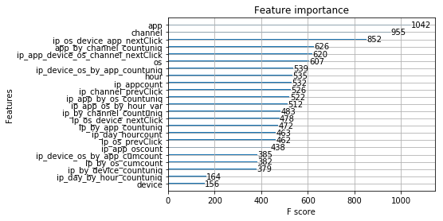


```python
%%time
#del X_train, X_test
gc.collect()
model_file = '../models/' + settings['title'] + settings['subtitle'] + '.txt'
output_file = '../output/' + settings['title'] + settings['subtitle'] + '.csv.gz'
settings['model_predict'](logger, model_file, settings['test_file'], output_file, settings['predictors'])
gc.collect()
```

    loading test data...
    Predicting...
    writing to file <../output/RunCase_0503_case_1_xgb_feature_v7_sup_gen.csv.gz>...
    done.
    CPU times: user 8min 25s, sys: 8.72 s, total: 8min 33s
    Wall time: 3min 52s


## Case 4
XGBoost 10-fold CV


```python
%%time
settings['subtitle'] = '_case_3_xgb_feature_v7_sup_10fold'
settings['train_file'] = "../input/train_feature_v7_sup.csv"
settings['train_sup_file'] = "../input/train_sup_feature_v7_sup.csv"
settings['test_file'] = "../input/test_feature_v7_sup.csv"
settings['seed'] = 47
settings['test_size'] = 0.01
settings['predictors'] = ['app', 'app_by_channel_countuniq', 'channel', 'device', 'hour', 
                          'ip_app_by_os_countuniq', 'ip_app_device_os_channel_nextClick', 
                          'ip_app_os_by_hour_var', 'ip_app_oscount', 'ip_appcount', 
                          'ip_by_app_countuniq', 'ip_by_channel_countuniq', 'ip_by_device_countuniq', 
                          'ip_by_os_cumcount', 'ip_channel_prevClick', 'ip_day_by_hour_countuniq', 
                          'ip_day_hourcount', 'ip_device_os_by_app_countuniq', 'ip_device_os_by_app_cumcount', 
                          'ip_os_device_app_nextClick', 'ip_os_device_nextClick', 'ip_os_prevClick', 'os']
settings['categorical'] = ['app', 'device', 'os', 'channel', 'hour']

settings['kfold'] = 10
settings['model'] = kfold.kfold_train
settings['base_model'] = base_models.xgboost_model
settings['model_predict'] = base_models.xgb_cv_predict
settings['params'] = default_config.xgboost_params
settings['model_train_predict'] = kfold.kfold_xgb_train_predict
settings['params']['randoms_state'] = settings['seed']
settings['params']['max_depth'] = 6
settings['params']['min_child_weight'] = 4
settings['params']['colsample_bylevel'] = 0.1
settings['params']['colsample_bytree'] = 1.0
settings['params']['scale_pos_weight'] = 500
settings['params']['subsample'] = 1.0
settings['params']['reg_lambda'] = 1000
settings['params']['max_delta_step'] = 20

logger = base.Logger(settings['title'] + settings['subtitle'])
logger.print_dict(settings, order = default_config.settings_list)

logger.print_log('loading train data...')
train_df = pd.read_csv(settings['train_file'], dtype=default_config.dtypes)
gc.collect()
logger.print_log('load finished.')
```

    log init.
    title           : RunCase_0503
    subtitle        : _case_2_xgb_feature_v7_sup_10fold
    model           : <function kfold_train at 0x7f5fba5778c8>
    train_file      : ../input/train_feature_v7_sup.csv
    test_file       : ../input/test_feature_v7_sup.csv
    seed            : 47
    target          : is_attributed
    predictors      : ['app', 'app_by_channel_countuniq', 'channel', 'device', 'hour', 'ip_app_by_os_countuniq', 'ip_app_device_os_channel_nextClick', 'ip_app_os_by_hour_var', 'ip_app_oscount', 'ip_appcount', 'ip_by_app_countuniq', 'ip_by_channel_countuniq', 'ip_by_device_countuniq', 'ip_by_os_cumcount', 'ip_channel_prevClick', 'ip_day_by_hour_countuniq', 'ip_day_hourcount', 'ip_device_os_by_app_countuniq', 'ip_device_os_by_app_cumcount', 'ip_os_device_app_nextClick', 'ip_os_device_nextClick', 'ip_os_prevClick', 'os']
    categorical     : ['app', 'device', 'os', 'channel', 'hour']
    model_predict   : <function xgb_cv_predict at 0x7f5fbd93e620>
    params          : {
                 nthread: 8
              reg_lambda: 1000
              max_leaves: 1400
               objective: binary:logistic
        colsample_bytree: 1.0
                  silent: True
               subsample: 1.0
                     eta: 0.3
       colsample_bylevel: 0.1
                   alpha: 4
             tree_method: hist
               max_depth: 6
        scale_pos_weight: 500
            random_state: 47
        min_child_weight: 4
           randoms_state: 47
             grow_policy: lossguide
             eval_metric: auc
          max_delta_step: 20
    }                  
    model_train_predict: <function kfold_xgb_train_predict at 0x7f5fba5779d8>
    test_size       : 0.01
    train_sup_file  : ../input/train_sup_feature_v7_sup.csv
    base_model      : <function xgboost_model at 0x7f5fbd93e510>
    kfold           : 10
    loading train data...
    load finished.
    CPU times: user 7min 59s, sys: 2min 16s, total: 10min 15s
    Wall time: 12min 31s


```python
%%time
settings['model'](settings['base_model'], settings['kfold'], train_df, settings['predictors'], 
                                settings['target'], settings['categorical'],settings['params'], 
                                logger, settings['title'] + settings['subtitle'])
```

    cv_0 start
    preparing validation datasets
    training...
    [0]	valid-auc:0.957447
    Will train until valid-auc hasn't improved in 30 rounds.
    [10]	valid-auc:0.979203
    [20]	valid-auc:0.982118
    [30]	valid-auc:0.983365
    [40]	valid-auc:0.984109
    [50]	valid-auc:0.984502
    [60]	valid-auc:0.984775
    [70]	valid-auc:0.984997
    [80]	valid-auc:0.985125
    [90]	valid-auc:0.98522
    [100]	valid-auc:0.985289
    [110]	valid-auc:0.985349
    [120]	valid-auc:0.985386
    [130]	valid-auc:0.985436
    [140]	valid-auc:0.985478
    [150]	valid-auc:0.985492
    [160]	valid-auc:0.985507
    [170]	valid-auc:0.985555
    [180]	valid-auc:0.985548
    [190]	valid-auc:0.985561
    [200]	valid-auc:0.98557
    [210]	valid-auc:0.985559
    [220]	valid-auc:0.985572
    [230]	valid-auc:0.985592
    [240]	valid-auc:0.98559
    [250]	valid-auc:0.985615
    [260]	valid-auc:0.985613
    [270]	valid-auc:0.985628
    [280]	valid-auc:0.985631
    [290]	valid-auc:0.985617
    [300]	valid-auc:0.985625
    Stopping. Best iteration:
    [271]	valid-auc:0.985631
    
    Model Report
    n_estimators : 271
    auc : 0.985631
    cv_0 finished.
    cv_1 start
    preparing validation datasets
    training...
    [0]	valid-auc:0.957554
    Will train until valid-auc hasn't improved in 30 rounds.
    [10]	valid-auc:0.978667
    [20]	valid-auc:0.98176
    [30]	valid-auc:0.983299
    [40]	valid-auc:0.983972
    [50]	valid-auc:0.984294
    [60]	valid-auc:0.984568
    [70]	valid-auc:0.984723
    [80]	valid-auc:0.984837
    [90]	valid-auc:0.984941
    [100]	valid-auc:0.985064
    [110]	valid-auc:0.985142
    [120]	valid-auc:0.985188
    [130]	valid-auc:0.985245
    [140]	valid-auc:0.985308
    [150]	valid-auc:0.985336
    [160]	valid-auc:0.985357
    [170]	valid-auc:0.985425
    [180]	valid-auc:0.985444
    [190]	valid-auc:0.985441
    [200]	valid-auc:0.985448
    [210]	valid-auc:0.985455
    [220]	valid-auc:0.985462
    [230]	valid-auc:0.98547
    [240]	valid-auc:0.985466
    [250]	valid-auc:0.985471
    [260]	valid-auc:0.985467
    [270]	valid-auc:0.985457
    [280]	valid-auc:0.985463
    Stopping. Best iteration:
    [258]	valid-auc:0.985477
    
    Model Report
    n_estimators : 258
    auc : 0.985477
    cv_1 finished.
    cv_2 start
    preparing validation datasets
    training...
    [0]	valid-auc:0.957621
    Will train until valid-auc hasn't improved in 30 rounds.
    [10]	valid-auc:0.978887
    [20]	valid-auc:0.9822
    [30]	valid-auc:0.983756
    [40]	valid-auc:0.984303
    [50]	valid-auc:0.984702
    [60]	valid-auc:0.984948
    [70]	valid-auc:0.985174
    [80]	valid-auc:0.985297
    [90]	valid-auc:0.985405
    [100]	valid-auc:0.985483
    [110]	valid-auc:0.985531
    [120]	valid-auc:0.985558
    [130]	valid-auc:0.985624
    [140]	valid-auc:0.985667
    [150]	valid-auc:0.985695
    [160]	valid-auc:0.98572
    [170]	valid-auc:0.985735
    [180]	valid-auc:0.985745
    [190]	valid-auc:0.985756
    [200]	valid-auc:0.985771
    [210]	valid-auc:0.985779
    [220]	valid-auc:0.985784
    [230]	valid-auc:0.985788
    [240]	valid-auc:0.985789
    [250]	valid-auc:0.985764
    [260]	valid-auc:0.985748
    Stopping. Best iteration:
    [234]	valid-auc:0.985794
    
    Model Report
    n_estimators : 234
    auc : 0.985794
    cv_2 finished.
    cv_3 start
    preparing validation datasets
    training...
    [0]	valid-auc:0.955961
    Will train until valid-auc hasn't improved in 30 rounds.
    [10]	valid-auc:0.977736
    [20]	valid-auc:0.981282
    [30]	valid-auc:0.982779
    [40]	valid-auc:0.983498
    [50]	valid-auc:0.983975
    [60]	valid-auc:0.984214
    [70]	valid-auc:0.984447
    [80]	valid-auc:0.984621
    [90]	valid-auc:0.984672
    [100]	valid-auc:0.984754
    [110]	valid-auc:0.984811
    [120]	valid-auc:0.984868
    [130]	valid-auc:0.984935
    [140]	valid-auc:0.984973
    [150]	valid-auc:0.984995
    [160]	valid-auc:0.985019
    [170]	valid-auc:0.985041
    [180]	valid-auc:0.985069
    [190]	valid-auc:0.985101
    [200]	valid-auc:0.985115
    [210]	valid-auc:0.985107
    [220]	valid-auc:0.985106
    [230]	valid-auc:0.985103
    [240]	valid-auc:0.9851
    Stopping. Best iteration:
    [215]	valid-auc:0.985119
    
    Model Report
    n_estimators : 215
    auc : 0.985119
    cv_3 finished.
    cv_4 start
    preparing validation datasets
    training...
    [0]	valid-auc:0.958655
    Will train until valid-auc hasn't improved in 30 rounds.
    [10]	valid-auc:0.979537
    [20]	valid-auc:0.982542
    [30]	valid-auc:0.98394
    [40]	valid-auc:0.984516
    [50]	valid-auc:0.984853
    [60]	valid-auc:0.98515
    [70]	valid-auc:0.985393
    [80]	valid-auc:0.985517
    [90]	valid-auc:0.985592
    [100]	valid-auc:0.985661
    [110]	valid-auc:0.985756
    [120]	valid-auc:0.985798
    [130]	valid-auc:0.985835
    [140]	valid-auc:0.985885
    [150]	valid-auc:0.985928
    [160]	valid-auc:0.985948
    [170]	valid-auc:0.985956
    [180]	valid-auc:0.985974
    [190]	valid-auc:0.985986
    [200]	valid-auc:0.985982
    [210]	valid-auc:0.986
    [220]	valid-auc:0.985998
    [230]	valid-auc:0.985996
    [240]	valid-auc:0.986008
    Stopping. Best iteration:
    [215]	valid-auc:0.986009
    
    Model Report
    n_estimators : 215
    auc : 0.986009
    cv_4 finished.
    cv_5 start
    preparing validation datasets
    training...
    [0]	valid-auc:0.957205
    Will train until valid-auc hasn't improved in 30 rounds.
    [10]	valid-auc:0.978493
    [20]	valid-auc:0.981504
    [30]	valid-auc:0.983072
    [40]	valid-auc:0.983664
    [50]	valid-auc:0.984178
    [60]	valid-auc:0.984446
    [70]	valid-auc:0.984647
    [80]	valid-auc:0.984789
    [90]	valid-auc:0.984927
    [100]	valid-auc:0.984992
    [110]	valid-auc:0.985058
    [120]	valid-auc:0.985129
    [130]	valid-auc:0.985155
    [140]	valid-auc:0.985213
    [150]	valid-auc:0.985254
    [160]	valid-auc:0.985274
    [170]	valid-auc:0.985328
    [180]	valid-auc:0.985347
    [190]	valid-auc:0.985349
    [200]	valid-auc:0.985347
    [210]	valid-auc:0.985344
    Stopping. Best iteration:
    [188]	valid-auc:0.985357
    
    Model Report
    n_estimators : 188
    auc : 0.985357
    cv_5 finished.
    cv_6 start
    preparing validation datasets
    training...
    [0]	valid-auc:0.95751
    Will train until valid-auc hasn't improved in 30 rounds.
    [10]	valid-auc:0.978946
    [20]	valid-auc:0.98249
    [30]	valid-auc:0.983916
    [40]	valid-auc:0.984592
    [50]	valid-auc:0.984982
    [60]	valid-auc:0.985182
    [70]	valid-auc:0.985367
    [80]	valid-auc:0.985512
    [90]	valid-auc:0.985578
    [100]	valid-auc:0.985667
    [110]	valid-auc:0.985757
    [120]	valid-auc:0.98583
    [130]	valid-auc:0.98587
    [140]	valid-auc:0.985896
    [150]	valid-auc:0.985927
    [160]	valid-auc:0.985985
    [170]	valid-auc:0.986002
    [180]	valid-auc:0.986021
    [190]	valid-auc:0.986018
    [200]	valid-auc:0.986033
    [210]	valid-auc:0.986037
    Stopping. Best iteration:
    [182]	valid-auc:0.986037
    
    Model Report
    n_estimators : 182
    auc : 0.986037
    cv_6 finished.
    cv_7 start
    preparing validation datasets
    training...
    [0]	valid-auc:0.957694
    Will train until valid-auc hasn't improved in 30 rounds.
    [10]	valid-auc:0.978266
    [20]	valid-auc:0.981424
    [30]	valid-auc:0.982781
    [40]	valid-auc:0.983477
    [50]	valid-auc:0.983896
    [60]	valid-auc:0.98422
    [70]	valid-auc:0.984392
    [80]	valid-auc:0.984529
    [90]	valid-auc:0.984667
    [100]	valid-auc:0.984768
    [110]	valid-auc:0.984845
    [120]	valid-auc:0.984879
    [130]	valid-auc:0.984936
    [140]	valid-auc:0.984992
    [150]	valid-auc:0.985031
    [160]	valid-auc:0.985056
    [170]	valid-auc:0.985077
    [180]	valid-auc:0.985084
    [190]	valid-auc:0.985135
    [200]	valid-auc:0.985163
    [210]	valid-auc:0.985179
    [220]	valid-auc:0.985169
    [230]	valid-auc:0.985177
    [240]	valid-auc:0.985184
    [250]	valid-auc:0.985197
    [260]	valid-auc:0.985194
    [270]	valid-auc:0.985191
    [280]	valid-auc:0.985195
    [290]	valid-auc:0.985196
    Stopping. Best iteration:
    [263]	valid-auc:0.985201
    
    Model Report
    n_estimators : 263
    auc : 0.985201
    cv_7 finished.
    cv_8 start
    preparing validation datasets
    training...
    [0]	valid-auc:0.95733
    Will train until valid-auc hasn't improved in 30 rounds.
    [10]	valid-auc:0.978706
    [20]	valid-auc:0.981905
    [30]	valid-auc:0.983191
    [40]	valid-auc:0.983796
    [50]	valid-auc:0.984188
    [60]	valid-auc:0.984452
    [70]	valid-auc:0.98463
    [80]	valid-auc:0.984724
    [90]	valid-auc:0.984834
    [100]	valid-auc:0.984987
    [110]	valid-auc:0.985086
    [120]	valid-auc:0.985142
    [130]	valid-auc:0.985215
    [140]	valid-auc:0.985238
    [150]	valid-auc:0.985292
    [160]	valid-auc:0.98531
    [170]	valid-auc:0.985356
    [180]	valid-auc:0.985374
    [190]	valid-auc:0.985382
    [200]	valid-auc:0.985393
    [210]	valid-auc:0.985407
    [220]	valid-auc:0.985429
    [230]	valid-auc:0.985437
    [240]	valid-auc:0.985456
    [250]	valid-auc:0.985454
    [260]	valid-auc:0.985431
    [270]	valid-auc:0.985428
    Stopping. Best iteration:
    [243]	valid-auc:0.985461
    
    Model Report
    n_estimators : 243
    auc : 0.985461
    cv_8 finished.
    cv_9 start
    preparing validation datasets
    training...
    [0]	valid-auc:0.957204
    Will train until valid-auc hasn't improved in 30 rounds.
    [10]	valid-auc:0.978525
    [20]	valid-auc:0.981865
    [30]	valid-auc:0.983269
    [40]	valid-auc:0.984
    [50]	valid-auc:0.984401
    [60]	valid-auc:0.984625
    [70]	valid-auc:0.984801
    [80]	valid-auc:0.984999
    [90]	valid-auc:0.985097
    [100]	valid-auc:0.985173
    [110]	valid-auc:0.985265
    [120]	valid-auc:0.985368
    [130]	valid-auc:0.985388
    [140]	valid-auc:0.985424
    [150]	valid-auc:0.985435
    [160]	valid-auc:0.985456
    [170]	valid-auc:0.985475
    [180]	valid-auc:0.98548
    [190]	valid-auc:0.985491
    [200]	valid-auc:0.985509
    [210]	valid-auc:0.98552
    [220]	valid-auc:0.985499
    [230]	valid-auc:0.985503
    Stopping. Best iteration:
    [208]	valid-auc:0.985522
    
    Model Report
    n_estimators : 208
    auc : 0.985522
    cv_9 finished.
    done.
    CPU times: user 2d 21h 44min 4s, sys: 6h 7min 17s, total: 3d 3h 51min 22s
    Wall time: 19h 22min 2s


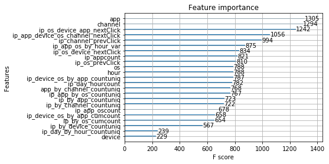


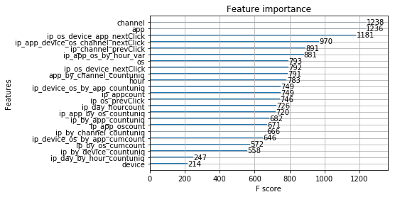


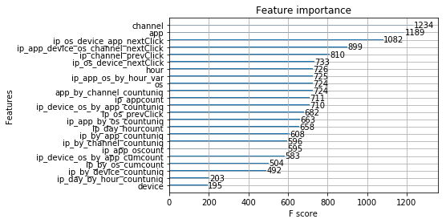


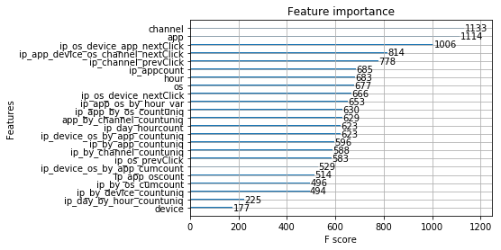


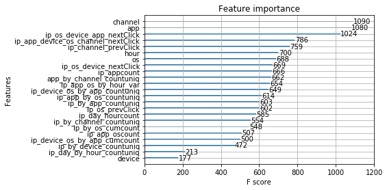


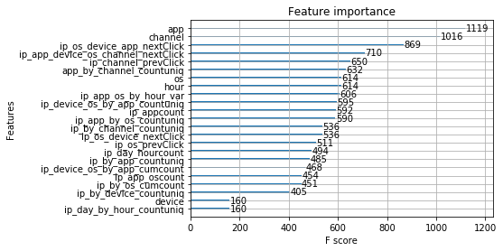


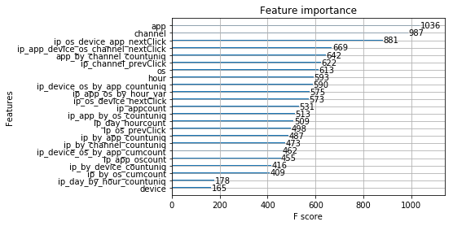


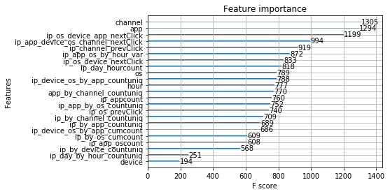


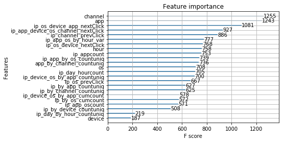


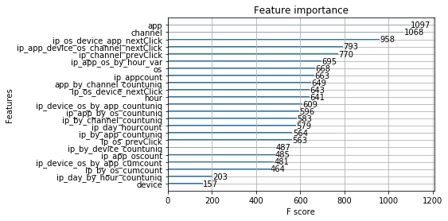


```python
%%time
output_file = '../output/' + settings['title'] + settings['subtitle'] + '.csv'
model_files = []
for i in range(settings['kfold']):
    model_files.append('../models/' + settings['title'] + settings['subtitle'] + '_cv_' + str(i) + '.txt')
settings['model_predict'](logger, model_files, settings['test_file'], output_file, settings['predictors'])
gc.collect()
```

    loading test data...
    Predicting...
    writing to file <../output/RunCase_0503_case_3_xgb_feature_v7_sup_10fold.csv>...
    done.
    CPU times: user 59min 40s, sys: 50.7 s, total: 1h 31s
    Wall time: 13min 41s


```python
%%time
model_files = []
for i in range(settings['kfold']):
    model_files.append('../models/' + settings['title'] + settings['subtitle'] + '_cv_' + str(i) + '.txt')
settings['model_train_predict'](model_files, settings['kfold'], train_df, settings['predictors'],
                        settings['target'], logger, settings['title'] + settings['subtitle'])
gc.collect()
```

    cv_0 scores: 0.985631
    cv_1 scores: 0.985477
    cv_2 scores: 0.985794
    cv_3 scores: 0.985119
    cv_4 scores: 0.986009
    cv_5 scores: 0.985357
    cv_6 scores: 0.986037
    cv_7 scores: 0.985201
    cv_8 scores: 0.985461
    cv_9 scores: 0.985522
    mean scores: 0.985561
    writing to file <../output/RunCase_0503_case_3_xgb_feature_v7_sup_10fold_train.csv>...
    done.
    CPU times: user 1h 8min 4s, sys: 30min 25s, total: 1h 38min 29s
    Wall time: 1h 19min 58s


## Case 5
stacking 


```python
%%time
from sklearn.linear_model import LogisticRegressionCV

settings['subtitle'] = '_case_2_stacking_v2_feature_v7_sup_3fold'
settings['stacker'] = LogisticRegressionCV(Cs=10, random_state=47, cv=3)
settings['cv'] = True
settings['test_size'] = 0.01
settings['seed'] = 47

settings['base_models'] = {    
    "lgbm_7_all": "RunCase_0502_case_2_lgb_feature_v7_sup_10fold",
    "xgb_7_all" : "RunCase_0503_case_3_xgb_feature_v7_sup_10fold",
}

settings['lb_scores'] = {
    "lgbm_7_all": 0.9806,
    "xgb_7_all" : 0.9806,    
}

settings['sub_train_file'] = {   
    "lgbm_7_all": "../output/RunCase_0502_case_2_lgb_feature_v7_sup_10fold_train.csv",    
    "xgb_7_all" : "../output/RunCase_0503_case_3_xgb_feature_v7_sup_10fold_train.csv",
}

settings['train_file'] = "../input/train.csv"

settings['sub_test_file'] = {
    "lgbm_7_all": "../output/RunCase_0502_case_2_lgb_feature_v7_sup_10fold.csv",    
    "xgb_7_all" : "../output/RunCase_0503_case_3_xgb_feature_v7_sup_10fold.csv",
}


settings['test_file'] = "../output/" + settings['title'] + settings['subtitle'] + "_test.csv"

settings['almost_zero'] = 1e-10
settings['almost_one'] = 1 - settings['almost_zero']

logger = base.Logger(settings['title'] + settings['subtitle'])
logger.print_dict(settings, order = default_config.settings_list)

settings['cvdata'] = pd.DataFrame( { 
    m: pd.read_csv(settings['sub_train_file'][m])['predictions'].clip(settings['almost_zero'],settings['almost_one']).apply(logit) 
    for m in settings['base_models']
} )

gc.collect()
settings['X_train'] = np.array(settings['cvdata'])
settings['y_train'] = np.array(pd.read_csv(settings['train_file'])['is_attributed'])
gc.collect()
```

    log init.
    title           : RunCase_0504
    subtitle        : _case_2_stacking_v2_feature_v7_sup_3fold
    train_file      : ../input/train.csv
    sub_train_file  : {
               xgb_7_all: ../output/RunCase_0503_case_3_xgb_feature_v7_sup_10fold_train.csv
              lgbm_7_all: ../output/RunCase_0502_case_2_lgb_feature_v7_sup_10fold_train.csv
    }                  
    sub_train_file  : {
               xgb_7_all: ../output/RunCase_0503_case_3_xgb_feature_v7_sup_10fold_train.csv
              lgbm_7_all: ../output/RunCase_0502_case_2_lgb_feature_v7_sup_10fold_train.csv
    }                  
    test_file       : ../output/RunCase_0504_case_2_stacking_v2_feature_v7_sup_3fold_test.csv
    seed            : 47
    target          : is_attributed
    predictors      : ['app', 'device', 'os', 'channel', 'time', 'day', 'ip_tcount', 'ip_tchan_count', 'ip_app_count', 'ip_app_os_count', 'ip_app_os_var', 'ip_app_channel_var_day', 'ip_app_channel_mean_time']
    categorical     : ['app', 'device', 'os', 'channel', 'time', 'day']
    cv              : True
    sub_test_file   : {
               xgb_7_all: ../output/RunCase_0503_case_3_xgb_feature_v7_sup_10fold.csv
              lgbm_7_all: ../output/RunCase_0502_case_2_lgb_feature_v7_sup_10fold.csv
    }                  
    test_size       : 0.01
    lb_scores       : {
               xgb_7_all: 0.9801
              lgbm_7_all: 0.9806
    }                  
    base_models     : {
               xgb_7_all: RunCase_0503_case_3_xgb_feature_v7_sup_10fold
              lgbm_7_all: RunCase_0502_case_2_lgb_feature_v7_sup_10fold
    }                  
    stacker         : LogisticRegressionCV(Cs=10, class_weight=None, cv=3, dual=False,
               fit_intercept=True, intercept_scaling=1.0, max_iter=100,
               multi_class='ovr', n_jobs=1, penalty='l2', random_state=47,
               refit=True, scoring=None, solver='lbfgs', tol=0.0001, verbose=0)
    almost_one      : 0.9999999999
    almost_zero     : 1e-10
    CPU times: user 3min 15s, sys: 1min 37s, total: 4min 53s
    Wall time: 5min 11s


```python
%%time
stacking.stacking_val(settings, logger)
```

    getting stacker CV...
    train's auc: 0.9859209001479415
    valid's auc: 0.9852178383389066
    CPU times: user 1h 3min 9s, sys: 36min 22s, total: 1h 39min 31s
    Wall time: 49min 5s


```python
%%time
settings = stacking.stacking_fit(settings, logger)
stacking.stacking_predict(settings, logger)
```

                lgbm_7_all  xgb_7_all
    lgbm_7_all    1.000000   0.939272
    xgb_7_all     0.939272   1.000000
    [[0.55259043 0.4678354 ]]
                                                   CV score  LB score    weight
    RunCase_0502_case_2_lgb_feature_v7_sup_10fold  0.985534    0.9806  0.541529
    RunCase_0503_case_3_xgb_feature_v7_sup_10fold  0.985558    0.9801  0.458471
    Train score: 0.9859139739144834
    writing to file <../output/RunCase_0504_case_2_stacking_v2_feature_v7_sup_3fold.csv.gz>...
    done.
    CPU times: user 1h 10min 8s, sys: 26min 8s, total: 1h 36min 17s
    Wall time: 51min

